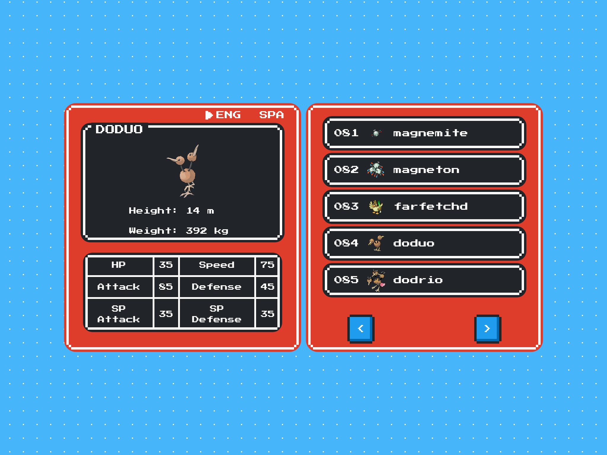

# React Pokedex

[](https://shields.io/)
[](https://shields.io/)

## Setup

```sh
# clone repo
git clone https://github.com/dotmotion/react-pokedex.git
```

```sh
# install dependencies
npm install
```

```sh
# run the project
npm run start
```

## Details

- Used [i18N](https://github.com/i18next/react-i18next) for multi language support (_english / spanish_)

- Data from [pokéapi](https://github.com/PokeAPI/pokeapi)

- 8-bit retro style with [NES.css](https://github.com/nostalgic-css/NES.css)

## Screenshot


